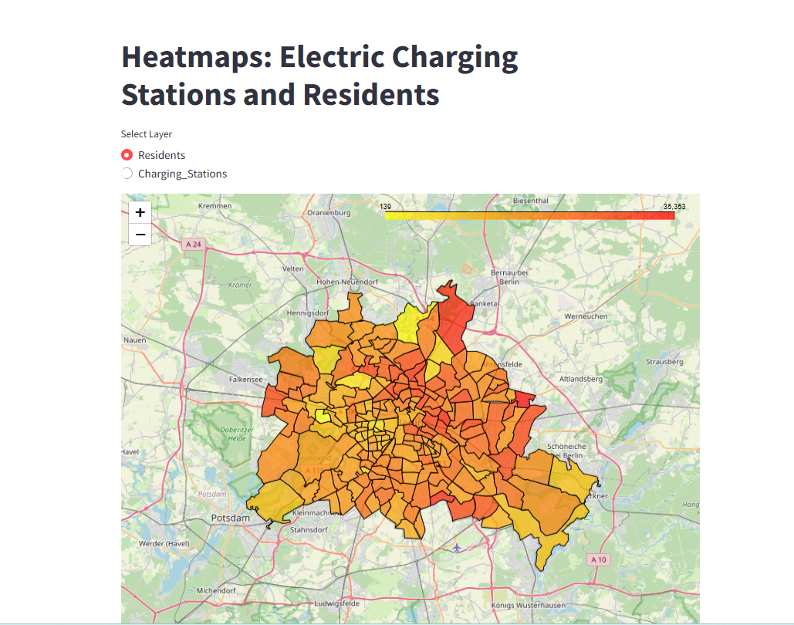
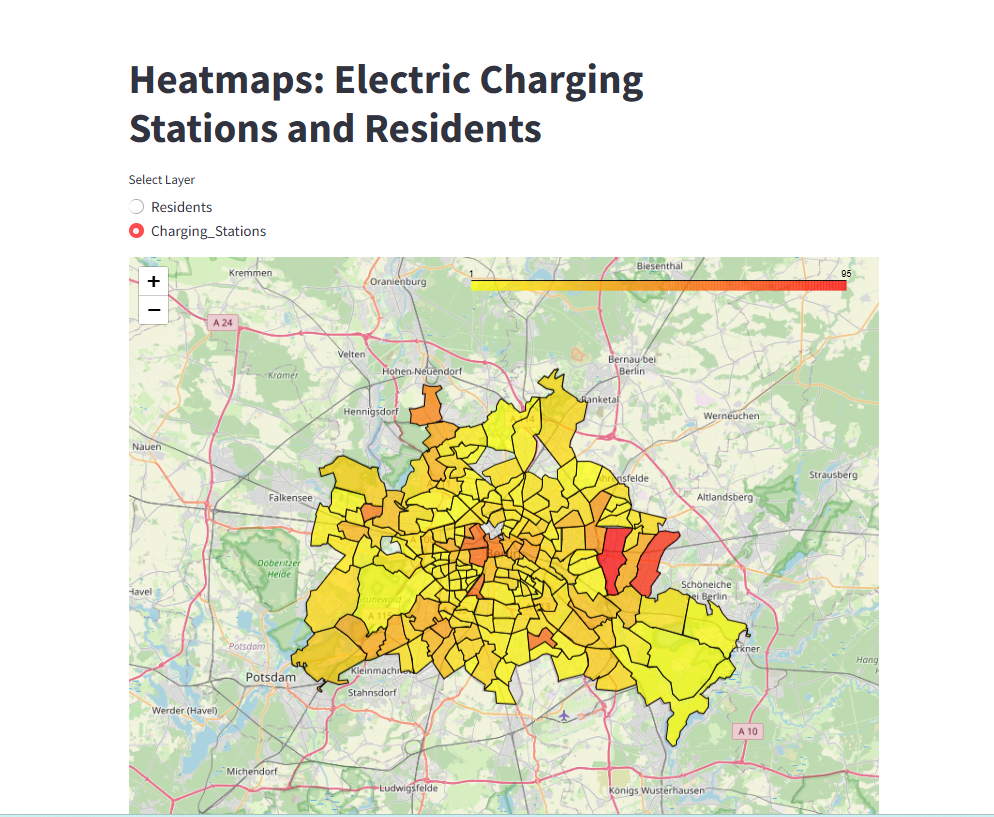

# Installation

1. Install Python 3.10+ on your system, restart system

   - Example here: Windows 11

2. Open Command Prompt and run the following commands:

   ```sh
   c:
   cd C:\(...)\src
   python -m venv .venv
   .venv\Scripts\activate.bat
   pip install -r requirements.txt
   pip install spyder
   ```

# Launch

1. Open Command Prompt and run the following commands:

   ```sh
   c:
   cd C:\(...)\src
   .venv\Scripts\activate.bat
   spyder
   ```

# Start Streamlit App

1. Open Command Prompt and run the following command:

   ```sh
   streamlit run main.py
   ```

# Open documentation

1. navigate to `docs` and open `index.html`

# Conclusions

comparing the two visualizations, it is obvious that there are a number of inefficiencies:

- Areas with high population density (central and inner-city districts) are underserved compared to their residential concentration. This could lead to congestion at charging points and inconvenience for EV users.
- Some low-density areas seem to have a disproportionate number of charging stations compared to their population. Resources might be better allocated to regions with higher demand.
- Many outer suburbs with moderate population density have very few charging stations, which might deter EV adoption for residents in these neighborhoods.

It is interesting to notice that the mismatch between the two is not only, as one would expect, an insufficient number of charging spots in high population areas, but also that in some regions there are too many charging spots in relation to the residents. This shows an inefficient planning, so the logical conclusion would be to better allocate resources for futre charging spots installations.

# Output



